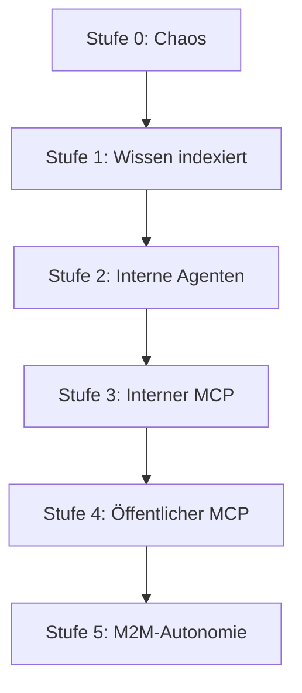

# Agentic Maturity Model

<div align="center">
  
  
  
</div>


> [!NOTE]
> **Proof of Concept & Infrastructure Blueprint**  
> Dieses Repository ist Teil einer konzeptionellen Infrastruktur für Agentic Commerce. Es dient als **Proof of Concept (PoC)** und Framework-Vorlage. Der Code ist experimentell und soll Entwicklern als Ausgangspunkt dienen, um eigene M2M- und Agenten-Systeme weiterzuentwickeln. Es handelt sich noch nicht um ein finales, produktionsreifes Release.


> Ein Reifegradmodell für die agentische Transformation von Unternehmen.

Jedes Unternehmen steht vor der gleichen Frage: Wie weit sind wir — und was kommt als nächstes? Das **Agentic Maturity Model (AMM)** ist das definitive Reifegradmodell für die Transformation ins Agent-Zeitalter. Es ist das CMMI und ITIL der neuen Ära — von Chaos (0) bis zur M2M-Autonomie (5).

Die Kernthese: Unternehmen brauchen eine klare, stufenweise Roadmap zur KI-Adoption. Der isolierte Einsatz von ChatGPT ist keine Strategie, sondern Schatten-IT. Eine echte agentische Transformation erfasst Infrastruktur, Organisation, Strategie und Sicherheit gleichermaßen.

## Die 6 Stufen der Transformation



1. **Stufe 0: Chaos** – Keine KI-Strategie, manuelle Prozesse, Papier, PDF.
2. **Stufe 1: Wissen indexiert** – RAG, Embeddings, unternehmensweite Suche.
3. **Stufe 2: Interne Agenten** – KI führt Prozesse aus statt Menschen.
4. **Stufe 3: Interner MCP** – Ein Model Context Protocol (MCP) Server für alle internen Systeme.
5. **Stufe 4: Öffentlicher MCP** – Der Nachfolger der Website. Externe Agenten interagieren mit Ihrem Unternehmen.
6. **Stufe 5: M2M-Autonomie** – Agenten handeln mit Agenten. Autonome Verhandlungen und Transaktionen.

## Assessment Tool

Dieses Repository enthält das Assessment-Tool, um den aktuellen Reifegrad Ihres Unternehmens (oder Ihrer Kunden) zu ermitteln.

```bash
# Ausführen des Assessments
npx agentic-maturity-model assess path/to/answers.json
```

## Benchmark-Daten (Deutschland 2026)

Der deutsche Mittelstand steht heute bei 0–1. Unser Ziel für Kunden in 18 Monaten: Stufe 3, Leuchttürme Stufe 4.

* **Tech/SaaS**: Ø 2.3
* **Financial Services**: Ø 1.5
* **Retail**: Ø 1.2
* **Manufacturing**: Ø 0.8
* **Professional Services**: Ø 0.7
* **Healthcare**: Ø 0.5
* **Public Sector**: Ø 0.3

## Workshop & Transformation

Nutzen Sie die Vorlagen im `templates/`-Verzeichnis für Ihre Assessments:
* `workshop-agenda.md`: 2-stündiges C-Level Assessment
* `executive-summary.md`: Vorstandspräsentation
* `transformation-roadmap.md`: Plan für die Transition


---

**Teil des Agentic Commerce Stack von Matteo Ise:**

- [well-known-mcp](https://github.com/matteo-ise/well-known-mcp) — Discovery-Standard für KI-Agenten
- [agent-wallet-sdk](https://github.com/matteo-ise/agent-wallet-sdk) — Unified Payment Infrastructure für Agenten
- [agent-governance](https://github.com/matteo-ise/agent-governance) — Audit, Compliance & Human-Escalation
- [mcp-deutschland](https://github.com/matteo-ise/mcp-deutschland) — MCP-Server für ELSTER, DATEV, XRechnung
- [mcp-handelsregister](https://github.com/matteo-ise/mcp-handelsregister) — Deutsches Handelsregister für Agenten
- [agentic-commerce-sdk](https://github.com/matteo-ise/agentic-commerce-sdk) — Agent-to-Agent Commerce
- [agentic-maturity-model](https://github.com/matteo-ise/agentic-maturity-model) — Reifegrad-Framework (Stufe 0→5)
- [kontorstack](https://github.com/matteo-ise/kontorstack) — Full-Stack Framework für agentische Unternehmen

[Matteo Ise auf GitHub](https://github.com/matteo-ise) · [X/Twitter](https://x.com/matteoise)
